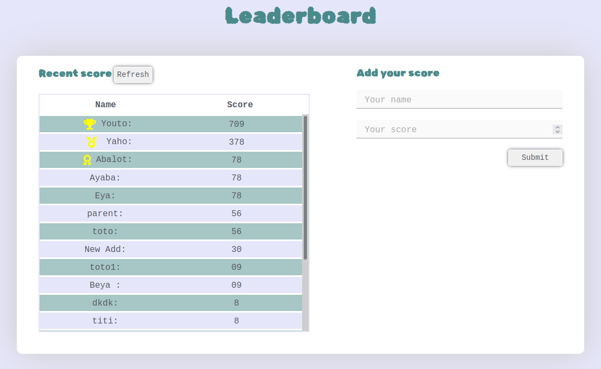

# Leaderboard

> The leaderboard website displays scores submitted by different players. It also allows you to submit your score. All data is preserved thanks to the external Leaderboard API service.

## Demo link
Live version [here](https://lionrouge1.github.io/Leaderboard/)

## Built With

- HTML
- CSS
- Javascript
- Webpack

## Getting Start
- `git clone https://github.com/LionRouge1/Leaderboard.git` to clone the repo.
- `cd Leaderboard`
- `npm install`
- `npm start`

### Run tests
- `npx hint .` to run Webhint
- `npx stylelint "**/*.{css,scss}"` to run Stylelint
- `npx eslint .` to run ESLint

## Author

👤 **Matchoudi**

- GitHub: [@githubhandle](https://github.com/LionRouge1)

## 🤝 Contributing

Contributions, issues, and feature requests are welcome!

Feel free to check the [issues page](../../issues/).

## Show your support

Give a ⭐️ if you like this project!

## Acknowledgments

- Hat tip to anyone whose code was used
- Inspiration
- etc

## 📝 License

This project is [MIT](./MIT.md) licensed.
